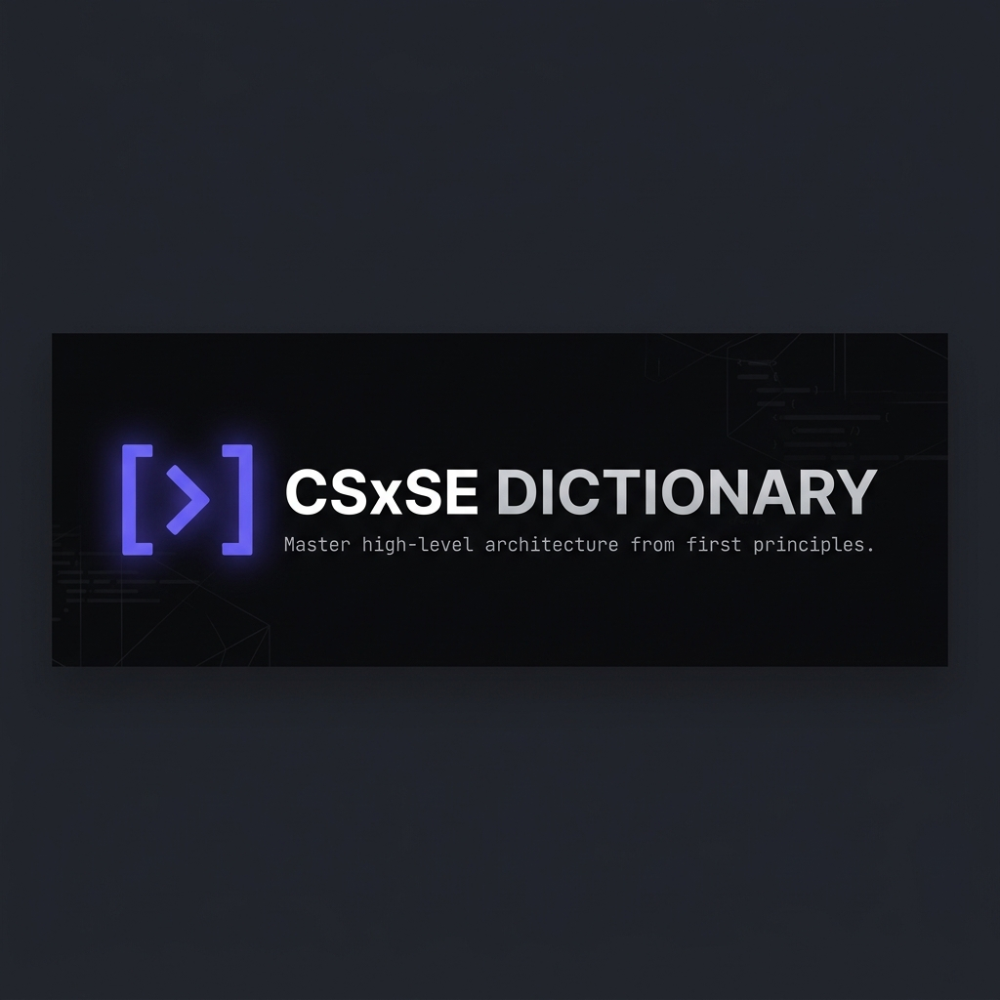

<p align="center">
  
</p>

<h1 align="center"> [ > ] CSxSE Dictionary </h1>

<p align="center">
  <strong>A pedagogy-first mastery platform for Computer Science & Software Engineering.</strong>
</p>

<p align="center">
  <a href="https://github.com/AyushSahoo19/CSxSE/stargazers"></a>
  <a href="https://github.com/AyushSahoo19/CSxSE/network/members"></a>
  <a href="https://github.com/AyushSahoo19/CSxSE/blob/main/LICENSE"></a>
</p>

---

## 👁️ Vision & Purpose

**CSxSE Dictionary** was born out of a simple observation: the gap between academic theory and industry reality is filled with unnecessary jargon. Our vision is to provide a "Curriculum as a Service" — a definitive, structured bridge that allows developers to traverse from first principles to high-level system architecture without losing context.

The purpose of this platform is to **democratize deep technical knowledge**. We don't just define terms; we anchor them with real-world analogies and organize them into a logical learning path, ensuring you understand *why* a concept exists before you learn *how* to implement it.

---

## 🚀 Key Features

- **Mastery-Based Sequence**: Knowledge is not alphabetical; it's cumulative. Our entries are ordered by pedagogical dependency.
- **380+ Atomic Concepts**: From the Physics of a CPU to the Complexity of Distributed Consensus.
- **Real-World Examples**: Every entry includes a practical scenario to ground abstract theory in reality.
- **Learning Hub**: Integrated curated list of the best courses and YouTube channels for deep dives.
- **Minimalist UX**: A high-performance, dark-themed editorial interface designed to stay out of your way.

---

## 🗺️ The Curriculum Roadmap

The dictionary is organized into **6 Strategic Phases**, taking you from an enthusiast to an architect.

| Phase | Title | Focus Areas |
| :--- | :--- | :--- |
| **01** | **Build Foundations** | Fundamentals, Algorithms, Math & Theory, Data Structures. |
| **02** | **Think in Systems** | Computer Architecture, Programming Paradigms, Design Patterns. |
| **03** | **Go Deep on Internals** | Operating Systems, Networking & Web. |
| **04** | **Data & Services** | Databases, Data Engineering, Backend & Frontend. |
| **05** | **Design & Scale** | System Design, Distributed Systems, Cloud Computing. |
| **06** | **Professionalize** | Security, Testing, DevOps, AI/ML, and Career. |

---

## 📖 The Dictionary

The core of the project is a **Content Collection** of Markdown files. This ensures high performance, easy maintenance, and accessibility.

- **Foundational**: Core terms everyone should know.
- **Intermediate**: Concepts required for building reliable applications.
- **Advanced**: Structural and architectural knowledge.
- **Expert**: Deep internals and complex system reasoning.

---

## 🛠 Project Setup

Built with **Astro 6** for lightning-fast static delivery.

```bash
# Install dependencies
npm install

# Start development server
npm run dev

# Build for production
npm run build
```

---

<p align="center">
  <i>"Software Engineering is the bridge between physics and philosophy."</i>
</p>
